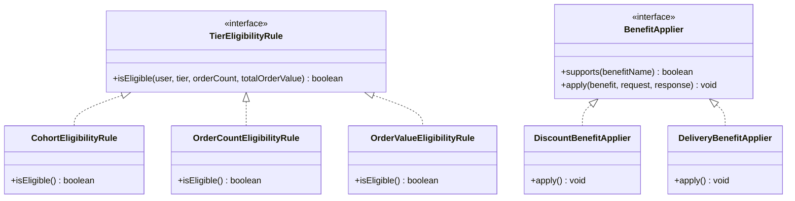

# FirstClub Membership & Tier Management System

An enterprise-ready Spring Boot backend system for subscription-based membership tiers, pricing plans, and automated tier evaluations. Integrated with shopping and checkout milestones, the system enforces configurable benefits, user cohorts, concurrent safety, and highly extensible design patterns.

---

## 💡 Key Architectural Design Patterns

This system has been built focusing on code modularity, flexibility, and compliance with SOLID principles. We implement two core design patterns to isolate business rules and facilitate extensions:

### 1. The Rule Engine Pattern (Tier Evaluation)
Instead of nesting validation checks inside a single service method, we isolate tier rules into specialized rule strategies implementing [TierEligibilityRule](file:///Users/abhranilbhattacharjee/Public/Personal%20Projects/FirstClubMembership/src/main/java/com/firstclub/membership/service/tier/TierEligibilityRule.java):
* **CohortEligibilityRule**: Validates user cohort requirements.
* **OrderCountEligibilityRule**: Evaluates minimum order count thresholds.
* **OrderValueEligibilityRule**: Evaluates rolling 30-day total order value thresholds.

This obeys the **Open-Closed Principle (OCP)**. If a new rule constraint is needed (e.g., tenure duration or region gating), you only need to create a new class implementing `TierEligibilityRule` and register it as a bean. The evaluation engine automatically discovers and applies it.

### 2. The Strategy Pattern (Benefit Appliers for Checkout)
To integrate the membership benefits seamlessly with the checkout and shopping cart journey, we implement a checkout calculation service using the Strategy Pattern:
* **DiscountBenefitApplier**: Calculates cart discounts based on tier perk configuration values.
* **DeliveryBenefitApplier**: Maps delivery methods (Standard, Express, Same Day) to the shipping response.



---

## ⏳ Dynamic Membership Expiry Validation

To guarantee real-time data consistency and prevent users from enjoying membership benefits beyond their billing cycle, the system handles subscription expiry **dynamically (on-demand)** during lookup rather than relying solely on offline cron jobs.

### Key Workflows:
1. **Validation on Fetch**: Any request for the user's active membership (such as checkout perk application, tier evaluations, or retrieving user perks) calls `SubscriptionService.getActiveSubscription(userId)`.
2. **Dynamic Expiration**: If the current system time (`LocalDateTime.now()`) is after the subscription's `endDate`, the subscription's status is immediately updated to `EXPIRED` in the database, and the service returns an empty result.
3. **No Race Conditions**: Checking validity at the exact moment benefits are requested avoids stale windows where a user could receive discounts or free shipping after their subscription has ended.

---

## ⚡ Concurrency & Thread-Safety

To ensure enterprise-grade stability under concurrent load:
1. **Distributed Pessimistic Locking**: We coordinate writing locks on the `User` record via `SELECT FOR UPDATE` at the database level (`userRepository.findByIdForUpdate`). This blocks concurrent transactions attempting to subscribe, cancel, or auto-evaluate the same user's tier across multiple nodes/application instances, preventing race conditions.
2. **Optimistic Locking**: Mapped via `@Version` inside `BaseEntity` to safeguard records from dirty writes.

---

## 🚀 How to Run the Project

Ensure you have **JDK 17 or higher** installed.

```bash
./mvnw spring-boot:run
```
The application starts on port `8080`. The H2 database console is at `http://localhost:8080/h2-console` (JDBC URL: `jdbc:h2:mem:membershipdb`, User: `sa`, Password: `password`).

---

## 📋 Complete API Reference (CURL Commands)

Below is a complete reference of all REST endpoints exposed by this service.

### 1. Catalog APIs
* **Get All Plans**: Retrieve available billing durations (Monthly, Quarterly, Yearly) and pricing.
  ```bash
  curl -X GET http://localhost:8080/api/v1/catalog/plans
  ```
* **Get All Tiers**: Retrieve available tiers (Silver, Gold, Platinum) and their configured benefit rules.
  ```bash
  curl -X GET http://localhost:8080/api/v1/catalog/tiers
  ```

### 2. Subscription APIs
* **Create Subscription**: Subscribe a user to a specific plan and tier.
  ```bash
  curl -X POST http://localhost:8080/api/v1/subscriptions \
       -H "Content-Type: application/json" \
       -d '{
         "userId": 2,
         "planId": 1,
         "tierId": 1
       }'
  ```
* **Get Active Subscription**: Get active subscription details and billing period for a user.
  ```bash
  curl -X GET http://localhost:8080/api/v1/subscriptions/users/2
  ```
* **Upgrade or Downgrade**: Adjust the active subscription plan or tier.
  ```bash
  curl -X PUT "http://localhost:8080/api/v1/subscriptions/1?planId=2&tierId=2"
  ```
* **Fetch Active Perks**: Check premium indicators (Priority Support status, Early Access hours) and benefits for the active tier.
  ```bash
  curl -X GET http://localhost:8080/api/v1/subscriptions/users/2/perks
  ```
* **Cancel Subscription**: Set the status of the subscription to `CANCELLED`.
  ```bash
  curl -X POST http://localhost:8080/api/v1/subscriptions/1/cancel
  ```

### 3. Order APIs
* **Place Order**: Save an order transaction for a user and trigger real-time tier evaluation/auto-upgrades.
  ```bash
  curl -X POST http://localhost:8080/api/v1/orders \
       -H "Content-Type: application/json" \
       -d '{
         "userId": 2,
         "amount": 25.00
       }'
  ```

### 4. Evaluation APIs
* **Evaluate User Tier (Manual/Fallback)**: Manually execute rules engine check for user tier upgrade/downgrade.
  ```bash
  curl -X POST http://localhost:8080/api/v1/evaluations/users/2/evaluate-tier
  ```

### 5. Checkout APIs
* **Apply Checkout Benefits**: Calculate active discount perk reductions and apply shipping benefits.
  ```bash
  curl -X POST http://localhost:8080/api/v1/checkout/apply-benefits \
       -H "Content-Type: application/json" \
       -d '{
         "userId": 2,
         "originalPrice": 100.00
       }'
  ```

---

## 🛣️ API Documentation & Test Workflow (CURL Commands)


### Step 1: Query the Catalog
* **Get Plans**:
  ```bash
  curl -X GET http://localhost:8080/api/v1/catalog/plans
  ```
* **Get Tiers**:
  ```bash
  curl -X GET http://localhost:8080/api/v1/catalog/tiers
  ```

---

### Step 2: Test Cohort Rejection
Attempt to subscribe **Jane Smith** (`userId: 2`, cohort: `'Standard'`) directly to the **PLATINUM** tier (`tierId: 3`), which is gated for `'EarlyAdopter'` cohort members.

```bash
curl -X POST http://localhost:8080/api/v1/subscriptions \
     -H "Content-Type: application/json" \
     -d '{
       "userId": 2,
       "planId": 1,
       "tierId": 3
     }'
```
* **Expected Outcome**: `400 Bad Request` with:
  `{"message":"User does not belong to the eligible cohort for this tier"}`

---

### Step 3: Valid Subscription Creation
Subscribe Jane Smith (`userId: 2`) to the base **SILVER** tier (`tierId: 1`) under the Monthly Plan (`planId: 1`).

```bash
curl -X POST http://localhost:8080/api/v1/subscriptions \
     -H "Content-Type: application/json" \
     -d '{
       "userId": 2,
       "planId": 1,
       "tierId": 1
     }'
```
* **Expected Outcome**: `200 OK` showing subscription created under the `"SILVER"` tier. Note the `"id": 1` of the subscription returned.

---

### Step 4: Verify Base Cart Checkout Price
Calculate checkout benefits for Jane. The original cart price is $100.00. Since she is a `SILVER` member, she gets no extra discounts and standard free delivery.

```bash
curl -X POST http://localhost:8080/api/v1/checkout/apply-benefits \
     -H "Content-Type: application/json" \
     -d '{
       "userId": 2,
       "originalPrice": 100.00
     }'
```
* **Expected Outcome**: `200 OK` returning:
  `{"originalPrice":100.00,"discountedPrice":100.00,"shippingSpeed":"Standard","appliedBenefits":["Free Standard Delivery"]}`

---

### Step 5: Add Orders to Qualify for GOLD Tier
The `GOLD` tier requires a minimum of **5 orders** and a total value of **$100.00** in the last 30 days. Let's simulate 5 orders of $25.00 each (total $125.00) for Jane.

Run the following command **5 times**:
```bash
curl -X POST http://localhost:8080/api/v1/orders \
     -H "Content-Type: application/json" \
     -d '{
       "userId": 2,
       "amount": 25.00
     }'
```
*(Note: Each order placement will automatically trigger the rules engine to evaluate Jane's eligibility and upgrade her immediately).*

---


### Step 6: (Optional) Manual Re-evaluation Trigger
Although evaluation happens automatically when an order is completed, you can also trigger a manual rules evaluation using this fallback endpoint (useful for bulk processing or reconciliation jobs):

```bash
curl -X POST http://localhost:8080/api/v1/evaluations/users/2/evaluate-tier
```
* **Expected Outcome**: `200 OK`. (If she hasn't been upgraded yet, the server console logs will show the upgrade statement).

---

### Step 7: Verify Discounted Checkout Price (GOLD perks)
Calculate checkout benefits for Jane again. Because she was auto-upgraded to the `GOLD` tier, the strategy appliers will deduct **5%** from her cart and upgrade her to **Express** delivery.

```bash
curl -X POST http://localhost:8080/api/v1/checkout/apply-benefits \
     -H "Content-Type: application/json" \
     -d '{
       "userId": 2,
       "originalPrice": 100.00
     }'
```
* **Expected Outcome**: `200 OK` returning:
  `{"originalPrice":100.00,"discountedPrice":95.00,"shippingSpeed":"Express","appliedBenefits":["Free Express Delivery","Extra 5% Discount"]}`

---

### Step 8: Verify Exposed Premium Perks (Priority Support & Early Access)
Query the premium perks and configured tier benefits for Jane (User 2) based on her active membership:
```bash
curl -X GET http://localhost:8080/api/v1/subscriptions/users/2/perks
```
* **Expected Outcome**: `200 OK` returning:
  `{"tierName":"GOLD","hasPrioritySupport":false,"prioritySupportLevel":null,"hasEarlyAccess":false,"earlyAccessHours":null,"allBenefits":["Free Delivery (Express)","Extra Discount (5)"]}`
  *(Note: Since GOLD does not have Priority Support or Early Access benefits configured in data.sql, they are false. If Jane is upgraded to PLATINUM tier, this endpoint will return `hasPrioritySupport: true, prioritySupportLevel: "24/7", hasEarlyAccess: true, earlyAccessHours: "24 Hours"`).*

---

### Step 9: Cancel Subscription
Cancel the subscription.

```bash
curl -X POST http://localhost:8080/api/v1/subscriptions/1/cancel
```

